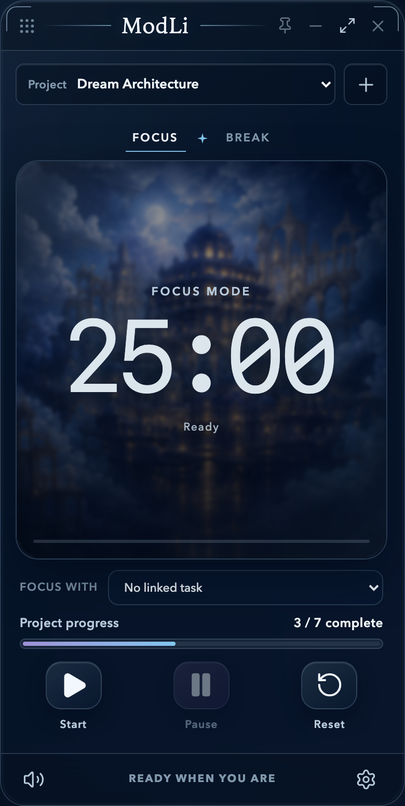
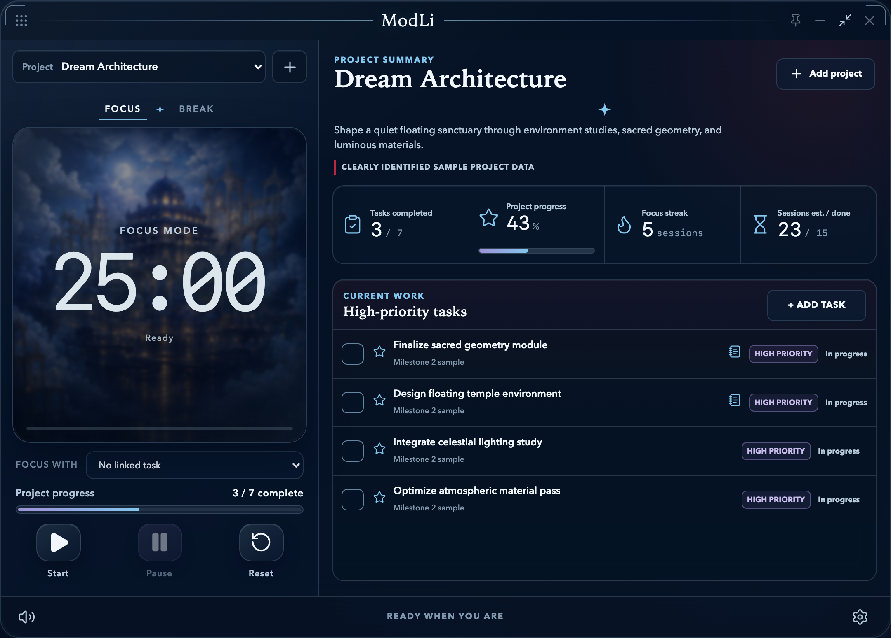
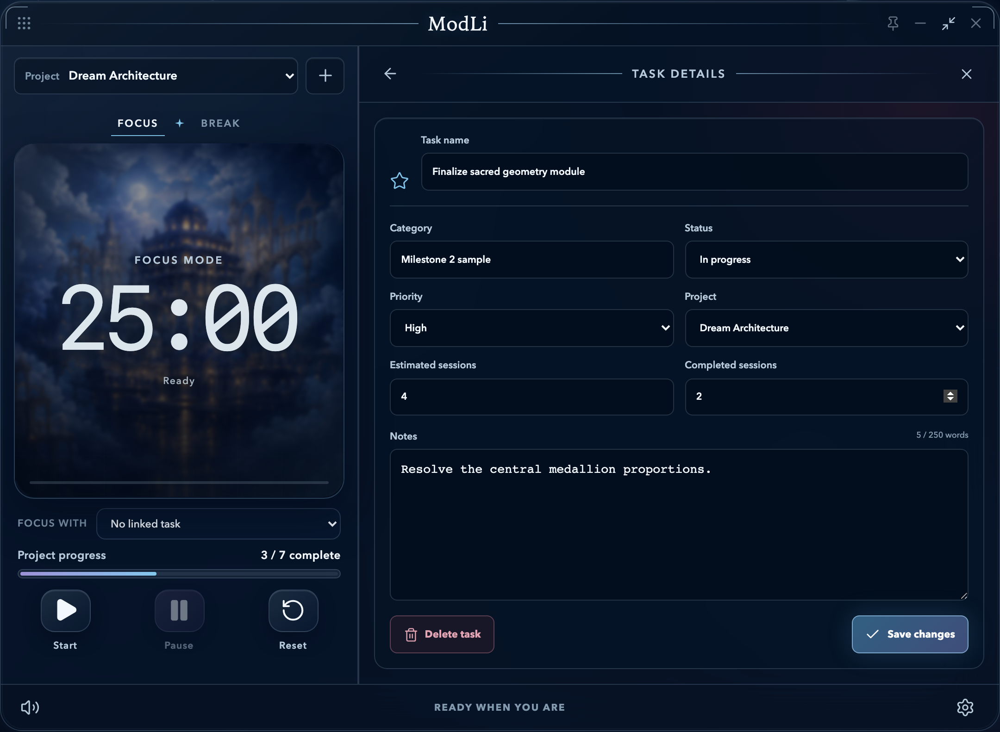
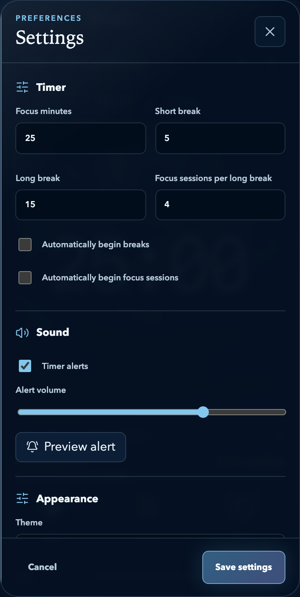

# ModLi

ModLi is a local-first Pomodoro timer and lightweight project companion built
with Svelte 5, TypeScript, Vite, and Tauri 2.

> [!NOTE]
> ModLi is currently a personal, experimental desktop application. This public
> repository supports learning and source visibility; it is not a distributed
> or supported product release.

[](https://github.com/LuniaOneiroi/modli-pomodoro-project/actions/workflows/ci.yml)
[](https://github.com/LuniaOneiroi/modli-pomodoro-project/actions/workflows/codeql.yml)

## Current scope

- Focus and break timers that work with or without a selected task
- Compact and expanded project views
- Local projects, tasks, session estimates, progress, and focus streaks
- Optional project artwork and appearance preferences
- Browser persistence for development and application-local persistence in Tauri
- A compact, always-on-top-capable macOS desktop window

ModLi has no accounts, backend, cloud sync, analytics, or runtime CDN
dependencies. Core functionality remains available offline.

## Screenshots

| Compact timer                                                                                      | Expanded project                                                                                       |
| -------------------------------------------------------------------------------------------------- | ------------------------------------------------------------------------------------------------------ |
|  |  |

| Task details                                                                                 | Settings                                                                                      |
| -------------------------------------------------------------------------------------------- | --------------------------------------------------------------------------------------------- |
|  |  |

## Data and privacy

Browser development stores structured state in `localStorage` and uploaded
project images in IndexedDB. The desktop build stores state and processed
project images in ModLi's operating-system application-data directory. Personal
projects, tasks, sessions, and uploaded images are not written into this
repository.

## Development

Install dependencies:

```sh
pnpm install
```

Run the browser prototype:

```sh
pnpm dev
```

Run ModLi in its native desktop window:

```sh
pnpm desktop:dev
```

Build the production web bundle and macOS application:

```sh
pnpm build
pnpm desktop:build
```

Run the quality checks:

```sh
pnpm check
pnpm lint
pnpm test
pnpm test:e2e
```

The end-to-end suite uses Chromium and WebKit. If the local Playwright browser
binaries are not installed yet, install them with:

```sh
pnpm exec playwright install chromium webkit
```

## Automated maintenance

GitHub Actions repeats type checking, linting, unit tests, the production build,
and Chromium/WebKit workflows after pushes to `main` and on pull requests.
CodeQL scans the JavaScript/TypeScript and Rust source on pushes, pull requests,
and a weekly schedule. Dependabot checks pnpm, Cargo, and GitHub Actions
dependencies every Monday and opens pull requests when updates are available.

Workflow results appear on the repository's Actions tab. GitHub notification
delivery is controlled by each user's notification settings; watching this
repository with custom **Actions** and **Security alerts** notifications enabled
is recommended.

The macOS `.app` and `.dmg` are written beneath
`src-tauri/target/release/bundle/`. Distribution to other Macs requires Apple
code signing and notarization; local development builds do not.

## Visual project materials

The files beneath `modli-wireframe/` and `assets-imgs/` are design references
and project artwork retained for ModLi's development. Runtime interface artwork
is organized beneath `src/assets/`; inspiration images are not embedded as
decorative screenshots.

## Licensing

No open-source license is currently provided. Public visibility of this
repository should not be interpreted as permission to redistribute or reuse its
code or visual assets.
